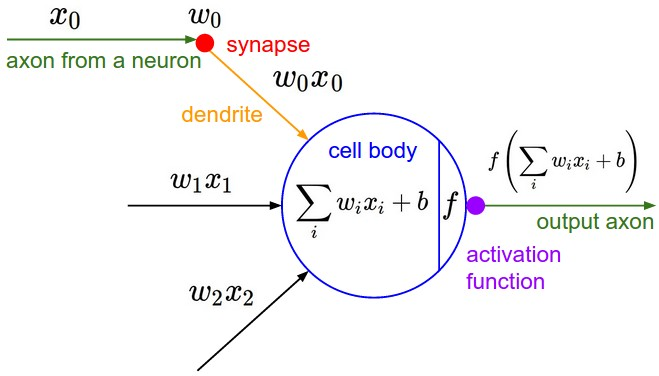

# **<u>Reading5. Neural Networks, Part 1</u>** (Lecture 4, 6)

## Quick intro

- In linear classification, the formula is $s=Wx$
- An example neural network would instead compute $s=W_2\max(0,W_1x)$
  - Notice that **the NON-LINEARITY is critical computationally** - <u>*if we left it out, the two matrices could be collapsed to a single matrix*</u>, and therefore the predicted class scores would again be a linear function of the input. The non-linearity is where we get the *wiggle*.
- A three-layer neural network could analogously look like $s=W_3max(0,W_2max(0,W_1x))$

## **Modeling one neuron**

### Biological motivation and connections


- The basic computational unit of the brain is a **neuron**. Approximately 86 billion neurons can be found in the human nervous system and 
- they are connected with approximately 10^14 - 10^15 **synapses**. 
- The diagram shows a cartoon drawing of a biological neuron (left) and a common mathematical model (right). 
  - Each neuron receives input signals from its **dendrites** and produces output signals along its (single) **axon**. 
  - The axon eventually branches out and connects via synapses to dendrites of other neurons. 
- In the computational model of a neuron, 
  - the signals that travel along the axons (e.g. $x_0$) 
  - interact multiplicatively (e.g. $w_0x_0$) with the dendrites of the other neuron 
  - based on the synaptic strength at that synapse (e.g. $w_0$). 
  - The idea is that the synaptic strengths (the weights $w$) are learnable and control the strength of influence (and its direction: excitory (positive weight) or inhibitory (negative weight)) of one neuron on another. 
- In the basic model, the dendrites carry the signal to the cell body where they all get summed. If the final sum is above a certain threshold, the neuron can *fire*, sending a spike along its axon. 
- In the computational model, we assume that the precise timings of the spikes do not matter, and that only the frequency of the firing communicates information. 
- Based on this *rate code* interpretation, we model the *firing rate* of the neuron with an **activation function** $f$, which represents the frequency of the spikes along the axon. 
  - Historically, a common choice of activation function is the **sigmoid function** $\sigma$, since it takes a real-valued input (the signal strength after the sum) and squashes it to range between 0 and 1. We will see details of these activation functions later in this section.
- **Coarse model.** 
  - It’s important to stress that this model of a biological neuron is very coarse: For example, 
    - there are many different types of neurons, each with different properties. 
    - The dendrites in biological neurons perform complex nonlinear computations. 
    - The synapses are not just a single weight, they’re a complex non-linear dynamical system. 
    - The exact timing of the output spikes in many systems is known to be important, suggesting that the rate code approximation may not hold.
  - See this [review](https://physics.ucsd.edu/neurophysics/courses/physics_171/annurev.neuro.28.061604.135703.pdf) (pdf), or more recently this [review](http://www.sciencedirect.com/science/article/pii/S0959438814000130) if you are interested.

### Single neuron as a linear classifier

- **Regularization interpretation**. The regularization loss in both SVM/Softmax cases could in this biological view be interpreted as *gradual forgetting*, since it would have the effect of driving all synaptic weights $w$ towards zero after every parameter update.
- *A single neuron can be used to implement a binary classifier (e.g. binary Softmax or binary SVM classifiers)*

### Commonly used activation functions

- **Sigmoid**
  - ​	
  - $\sigma(x)=1 /\left(1+e^{-x}\right)$
  - It has seen frequent use historically since it has a nice interpretation as the firing rate of a neuron
  - It has two major drawbacks:
    - *Sigmoids **saturate** and kill gradients*
      - when the neuron’s activation saturates at either tail of 0 or 1, <u>*the gradient at these regions is almost zero*</u>
    - *Sigmoid outputs are **not zero-centered***
      - This has implications on the dynamics during gradient descent
        - namely <u>*undesirable zig-zagging dynamics in the gradient updates*</u> for the weights
          (see notes for detail)
  - **Tanh**
    - ​	
    - $\tanh (x)=2 \sigma(2 x)-1$
    - zero-centered Sigmoid
- **ReLU** (Rectified Linear Unit)
  - ​	
  - $f(x)=\max (0, x)$
  - There are several pros and cons to using the ReLUs:
    - (+) It was found to greatly **accelerate** (e.g. a factor of 6 in [Krizhevsky et al.](http://www.cs.toronto.edu/~fritz/absps/imagenet.pdf)) the convergence of stochastic gradient descent compared to the sigmoid/tanh functions. It is argued that this is due to its <u>*linear, non-saturating form*</u>.
    - (+) Compared to tanh/sigmoid neurons that involve **expensive operations** (exponentials, etc.), the ReLU can be implemented by simply thresholding a matrix of activations at zero.
    - (-) Unfortunately, ReLU units can be fragile during training and can “die”.
      - For example, you may find that as much as 40% of your network can be “dead” (i.e. neurons that never activate across the entire training dataset) if the learning rate is set too high. 
      - With a proper setting of the learning rate this is less frequently an issue.
  - **Leaky ReLU**
    - $f(x)=\mathbb{1}(x<0)(\alpha x)+\mathbb{1}(x>=0)(x)$ where $\alpha$ is a small constant
    - one attempt to fix the “dying ReLU” problem
    - The slope in the negative region can also be made into a parameter of each neuron, as seen in **PReLU** neurons, introduced in [Delving Deep into Rectifiers](http://arxiv.org/abs/1502.01852), by Kaiming He et al., 2015.
    - However, <u>*the consistency of the benefit across tasks is presently unclear*</u>.
- **Maxout**
  - $\max \left(w_{1}^{T} x+b_{1}, w_{2}^{T} x+b_{2}\right)$
  - Notice that both ReLU and Leaky ReLU are a special case of this form (for example, for ReLU we have $w_1,b_1=0$). The Maxout neuron therefore <u>*enjoys all the benefits of a ReLU unit (linear regime of operation, no saturation) and does not have its drawbacks (dying ReLU)*</u>.
  - However, unlike the ReLU neurons it <u>*doubles the number of parameters*</u> for every single neuron
- **TLDR**: “*What neuron type should I use?*” 
  - <u>*Use the ReLU non-linearity*</u>, be careful with your learning rates and possibly monitor the fraction of “dead” units in a network. 
  - If this concerns you, give Leaky ReLU or Maxout a try. 
  - Never use sigmoid. Try tanh, but expect it to work worse than ReLU/Maxout.

## **Neural Network architectures**

### Layer-wise organization

- **Neural Networks as neurons in graphs**
  - modeled as collections of neurons that are connected in **an acyclic graph**
    - <u>*Cycles are not allowed*</u> since that would imply an infinite loop in the forward pass of a network
    - Instead of an amorphous blobs of connected neurons, Neural Network models are often organized into <u>*distinct layers of neurons*</u>.
    - For regular neural networks, the most common layer type is the **fully-connected layer**
      - in which <u>*neurons between two adjacent layers are fully pairwise connected*</u>, but <u>*neurons within a single layer share no connections*</u>.
- **Naming conventions**
  - When we say N-layer neural network, we do not count the input layer.
    - In that sense, logistic regression or SVMs are simply a special case of single-layer Neural Networks, and these networks interchangeably referred to as *“Artificial Neural Networks”* (ANN) or *“Multi-Layer Perceptrons”* (MLP)
- **Output layer**
  - Unlike all layers in a Neural Network, the output layer neurons most commonly **do not have an activation function** (or you can think of them as having a linear identity activation function). 
    - This is because the last output layer is usually taken to represent the class scores (e.g. in classification), which are arbitrary real-valued numbers, or some kind of real-valued target (e.g. in regression).
- **Sizing neural networks**
  - To measure the size of neural networks with **the number of neurons**, or more commonly **the number of parameters**.
    - e.g.	
    - The network (left) has 4 + 2 = 6 neurons (not counting the inputs), [3 x 4] + [4 x 2] = 20 weights and 4 + 2 = 6 biases, for a total of 26 learnable parameters.
  - Modern Convolutional Networks contain on orders of 100 million parameters and are usually made up of approximately 10-20 layers (hence *deep learning*). 
    - However, as we will see the number of *effective* connections is significantly greater due to parameter sharing.

### Example feed-forward computation

- *Repeated matrix multiplications interwoven with activation function*.
  - This structure makes it <u>*very simple and efficient to evaluate Neural Networks using matrix vector operations*</u>.
  - Thus, all examples would be efficiently evaluated in parallel
- *The forward pass of a fully-connected layer corresponds to one matrix multiplication followed by a bias offset and an activation function.*

### Representational power

- It turns out that **Neural Networks with at least one hidden layer are *universal approximators***.
  - That is, it can be shown (e.g. see [*Approximation by Superpositions of Sigmoidal Function*](http://www.dartmouth.edu/~gvc/Cybenko_MCSS.pdf) from 1989 (pdf), or this [intuitive explanation](http://neuralnetworksanddeeplearning.com/chap4.html) from Michael Nielsen) that
    - given any continuous function $f(x)$ and some $\epsilon>0$, there exists a Neural Network $g(x)$ with one hidden layer (with a reasonable choice of non-linearity, e.g. sigmoid) such that $\forall x,|f(x)-g(x)|<\epsilon$. 
    - In other words, the neural network can approximate any continuous function.
- If one hidden layer suffices to approximate any function, **why use more layers and go deeper**?
  - The fact above is, while mathematically cute, <u>*a relatively weak and useless statement in practice*</u>.
    - In one dimension, the “sum of indicator bumps” function $g(x)=\sum_{i} c_{i} \mathbb{1}\left(a_{i}<x<b_{i}\right)$ where $a, b, c$ are parameter vectors is also a universal approximator, but noone would suggest that we use this functional form in Machine Learning.
    - Neural Networks **work well in practice** because 
      - they <u>*compactly express nice, smooth functions that fit well*</u> with the statistical properties of data we encounter in practice, and 
      - are also <u>*easy to learn using our optimization algorithms*</u> (e.g. gradient descent).
  - Similarly, the fact that deeper networks (with multiple hidden layers) can work better than a single-hidden-layer networks is **an empirical observation**, despite the fact that <u>*their representational power is equal*</u>.
- As an aside,
  - in practice it is often the case that 3-layer neural networks will outperform 2-layer nets, but going even deeper (4,5,6-layer) rarely helps much more.
  - This is in stark contrast to Convolutional Networks, where depth has been found to be an extremely important component for a good recognition system
    - One argument for this observation is that images contain hierarchical structure (e.g. faces are made up of eyes, which are made up of edges, etc.)
- The topic's further reading:
  - [Deep Learning](http://www.deeplearningbook.org/) book in press by Bengio, Goodfellow, Courville, in particular [Chapter 6.4](http://www.deeplearningbook.org/contents/mlp.html).
  - [Do Deep Nets Really Need to be Deep?](http://arxiv.org/abs/1312.6184)
  - [FitNets: Hints for Thin Deep Nets](http://arxiv.org/abs/1412.6550)

### Setting number of layers and their sizes

- First, note that as we increase the size and number of layers in a Neural Network, the **capacity** of the network increases. That is, the space of representable functions grows since the neurons can collaborate to express many different functions.
  - However, this is both a blessing (since we can learn to classify more complicated data) and a curse (since it is easier to overfit the training data). 
    - **Overfitting** occurs when a model with high capacity <u>*fits the noise in the data instead of the (assumed) underlying relationship*</u>.
  - There are many other preferred ways to prevent overfitting in Neural Networks that we will discuss later (such as L2 regularization, dropout, input noise). In practice, <u>*it is always better to use these methods to control overfitting instead of the number of neurons*</u>.
    - The subtle reason:
      - In smaller networks, it turns out that many of these minima are easier to converge to, and that they are bad (i.e. with high loss).
      - Conversely, bigger neural networks contain significantly more local minima, but these minima turn out to be much better in terms of their actual loss.
- The takeaway is that **you should not be using smaller networks because you are afraid of overfitting**.

## **Summary**

- We introduced a very coarse model of a biological **neuron**.
- We discussed several types of **activation functions** that are used in practice, with ReLU being the most common choice.
- We introduced **Neural Networks** where neurons are connected with **Fully-Connected layers** where neurons in adjacent layers have full pair-wise connections, but neurons within a layer are not connected.
- We saw that this layered architecture enables very efficient evaluation of Neural Networks based on matrix multiplications interwoven with the application of the activation function.
- We saw that that Neural Networks are **universal function approximators**, but we also discussed the fact that this property has little to do with their ubiquitous use. They are used because they make certain “right” assumptions about the functional forms of functions that come up in practice.
- We discussed the fact that larger networks will always work better than smaller networks, but their higher model capacity must be appropriately addressed with stronger regularization (such as higher weight decay), or they might overfit. We will see more forms of regularization (especially dropout) in later sections.

### Additional References

- [deeplearning.net tutorial](http://www.deeplearning.net/tutorial/mlp.html) with Theano
- [ConvNetJS](http://cs.stanford.edu/people/karpathy/convnetjs/) demos for intuitions
- [Michael Nielsen’s](http://neuralnetworksanddeeplearning.com/chap1.html) tutorials

## *Thinking*

- Neural networks with one hidden layer are universal approximators (can approximate any function and achieve arbitrary approximation accuracy)
- 含一层隐藏层的神经网络是通用近似器（可以近似任意函数，并达到任意近似精准度）

# **<u>Reading6. Neural Networks, Part 2</u>** (Lecture 6)

## **Setting up the data and the model**

### Data Preprocessing

- **Mean subtraction**
  - It has the geometric interpretation of centering the cloud of data around the origin along every dimension.
  - With images specifically, for convenience it can be common to subtract a single value from all pixels (e.g. `X -= np.mean(X)`), or to do so separately across the three color channels.
- **Normalization**
  - refers to normalizing the data dimensions so that they are of approximately the same scale.
    - It only makes sense to apply this preprocessing if you have a reason to believe that different input features have different scales (or units), but they should be of approximately equal importance to the learning algorithm.
  - In case of images, the relative scales of pixels are already approximately equal (and in range from 0 to 255)
- **PCA and Whitening**
  - see Reading for detail
- **In practice**: 
  - PCA and Whitening are not used with Convolutional Networks.
  - However, it is very important to zero-center the data, and 
  - it is common to see normalization of every pixel as well.
- **Common pitfall**
  - Any preprocessing statistics (e.g. the data mean) **must only be computed on the training data, and then applied to the validation / test data**.
    - E.g. computing the mean and subtracting it from every image across the entire dataset and then splitting the data into train/val/test splits would be a mistake.

### Weight Initialization

- *With proper data normalization it is reasonable to assume that approximately half of the weights will be positive and half of them will be negative*
- **Pitfall: all zero initialization**
  - If every neuron in the network computes the same output, then they will also all compute the same gradients during backpropagation and undergo the exact same parameter updates.
  - In other words, <u>*there is no source of asymmetry between neurons if their weights are initialized to be the same*</u>.
- **Small random numbers**
  - `W = 0.01* np.random.randn(D,H)`, 
    where `randn` samples from a zero mean, unit standard deviation gaussian.
  - It is also possible to use small numbers drawn from a uniform distribution, but this seems to have relatively little impact on the final performance in practice.
  - ***Warning***: It’s not necessarily the case that smaller numbers will work strictly better.
    - For example, a Neural Network layer that has very small weights will during backpropagation compute very small gradients on its data.
- **Calibrating the variances with 1/sqrt(n)**
  - One problem with the above suggestion is that <u>*the distribution of the outputs from a randomly initialized neuron has a variance that grows with the number of inputs*</u>. Thus,
  - `w = np.random.randn(n) / sqrt(n)`, where `n` is the number of its inputs.
    This ensures that all neurons in the network initially have approximately the same output distribution and empirically improves the rate of convergence.
    - see notes for derivation / proof
      A similar analysis is carried out in [Understanding the difficulty of training deep feedforward neural networks](http://jmlr.org/proceedings/papers/v9/glorot10a/glorot10a.pdf) by Glorot et al.
  - `w = np.random.randn(n) * sqrt(2.0/n)`
    - A more recent paper on this topic, [Delving Deep into Rectifiers: Surpassing Human-Level Performance on ImageNet Classification](http://arxiv-web3.library.cornell.edu/abs/1502.01852) by He et al., derives an initialization specifically for ReLU neurons, reaching the conclusion that the variance of neurons in the network should be $2.0/n$.
    - It is <u>*the current recommendation*</u> for use in practice in the specific case of neural networks <u>*with ReLU neurons*</u>.
- **Sparse initialization**
  - Another way to address the uncalibrated variances problem is to set all weight matrices to zero, but to break symmetry every neuron is randomly connected (with weights sampled from a small gaussian as above) to a fixed number of neurons below it. A typical number of neurons to connect to may be as small as 10.
- **Initializing the biases**
  - It is possible and common <u>*to initialize the biases to be zero*</u>, since the asymmetry breaking is provided by the small random numbers in the weights. 
  - For ReLU non-linearities, some people like to use small constant value such as 0.01 for all biases because this ensures that all ReLU units fire in the beginning and therefore obtain and propagate some gradient. 
    - However, it is not clear if this provides a consistent improvement (in fact some results seem to indicate that this performs worse) and 
    - it is more common to simply use 0 bias initialization.
- **Batch Normalization**
  - A recently developed technique by Ioffe and Szegedy is [Batch Normalization](http://arxiv.org/abs/1502.03167)
  - Explicitly forcing the activations throughout a network **to take on a unit gaussian distribution at the beginning of the training**.
    - The core observation is that this is possible because <u>*normalization is a simple differentiable operation*</u>.
  - In the implementation, applying this technique usually amounts to insert the BatchNorm layer immediately after fully connected layers (or convolutional layers, as we’ll soon see), and before non-linearities.
  - Batch normalization can be interpreted as doing preprocessing at every layer of the network, but integrated into the network itself in a differentiable manner. Neat!

### Regularization

- Controlling the capacity of Neural Networks to prevent overfitting
- **L2 regularization**
  - The most common form of regularization
  - For every weight $w$ in the network, we add the term ${1\over 2}\lambda w^2$ to the objective, where $\lambda$ is the regularization strength.
    Encouraging the network to use all of its inputs a little rather than some of its inputs a lot
- **L1 regularization**
  - For each weight $w$ we add the term $\lambda |w|$ to the objective
    It leads the weight vectors to become sparse during optimization (i.e. very close to exactly zero). 
- **L1 vs. L2**
  - L1 regularization end up using only <u>*a sparse subset of their most important inputs*</u> and become nearly invariant to the “noisy” inputs. In comparison, final weight vectors from L2 regularization are usually <u>*diffuse, small numbers*</u>.
  - In practice, if you are not concerned with **explicit feature selection**, L2 regularization can be expected to give superior performance over L1.
- **Max norm constraints**
  - To enforce an absolute upper bound on the magnitude of the weight vector for every neuron and use projected gradient descent to enforce the constraint.
    One of its appealing properties is that network cannot “explode” even when the learning rates are set too high because the updates are always bounded.
- **Dropout**
  - An extremely effective, simple and recently introduced regularization technique by Srivastava et al. in [Dropout: A Simple Way to Prevent Neural Networks from Overfitting](http://www.cs.toronto.edu/~rsalakhu/papers/srivastava14a.pdf) (pdf) that complements the other methods (L1, L2, maxnorm)
  - While training, dropout is implemented by only keeping a neuron active with some probability $p$ (a hyperparameter), or setting it to zero otherwise.
  - During testing there is no dropout applied, with the interpretation of evaluating an averaged prediction across the exponentially-sized ensemble of all sub-networks
    - Since test-time performance is so critical, it is always preferable to use **inverted dropout**, which performs the scaling at train time, leaving the forward pass at test time untouched.
- **Other Regularization Techiques**
  - <u>see Reading</u>

### Loss functions

- The data loss takes the form of an average over the data losses for every individual example.
  - $L=\frac{1}{N} \sum_{i} L_{i}$ where $N$ is the number of training data
  - Lets abbreviate $f=f\left(x_{i} ; W\right)$ to be the activations of the output layer in a Neural Network
-  There are several types of problems you might want to solve in practice:
- **Classification**
  - One of two most commonly seen cost functions in this setting is the SVM (e.g. the Weston Watkins formulation)
    $L_{i}=\sum_{j \neq y_{i}} \max \left(0, f_{j}-f_{y_{i}}+1\right)$
    - As we briefly alluded to, some people report better performance with the <u>*squared hinge loss*</u>
      $\max \left(0, f_{j}-f_{y_{i}}+1\right)^{2}$
  - The second common choice is the Softmax classifier that uses the cross-entropy loss:
    $L_{i}=-\log \left(\frac{e^{f_{y_{i}}}}{\sum_{j} e^{f_{j}}}\right)$
  - **Problem: Large number of classes**
    - When the set of labels is very large, computing the full softmax probabilities becomes expensive.
    - <u>see Reading for detail</u>
- **Attribute classification**
  - For example, images on Instagram can be thought of as labeled with a certain subset of hashtags from a large set of all hashtags, and an image may contain multiple.
  - A sensible approach in this case is to build a binary classifier for every single attribute independently.
  - <u>see Reading for deatil</u>
- **Regression**
  - <u>see Reading for deatil</u>
- **Structured prediction**
  - <u>see Reading for deatil</u>

## **Summary**

- The recommended preprocessing is to center the data to have mean of zero, and normalize its scale to [-1, 1] along each feature
- Initialize the weights by drawing them from a gaussian distribution with standard deviation of $\sqrt{2/n}$, where $n$ is the number of inputs to the neuron. E.g. in numpy: `w = np.random.randn(n) * sqrt(2.0/n)`.
- Use L2 regularization and dropout (the inverted version)
- Use batch normalization
- We discussed different tasks you might want to perform in practice, and the most common loss functions for each task


# **<u>Reading7. Neural Networks, Part 3</u>** (Lecture 7)

## **Learning**

### Gradient Checks

- **Use the centered formula**
  $$
  \frac{d f(x)}{d x}=\frac{f(x+h)-f(x-h)}{2 h}
  $$
- **Use relative error for the comparison**
  $$
  \frac{\left|f_{a}^{\prime}-f_{n}^{\prime}\right|}{\max \left(\left|f_{a}^{\prime}\right|,\left|f_{n}^{\prime}\right|\right)}
  $$
  - In practice:
    - relative error > 1e-2 usually means the gradient is probably wrong
    - 1e-2 > relative error > 1e-4 should make you feel uncomfortable
    - 1e-4 > relative error is usually okay for objectives with kinks. But if there are no kinks (e.g. use of tanh nonlinearities and softmax), then 1e-4 is too high.
    - 1e-7 and less you should be happy.
  - Also keep in mind that *<u>the deeper the network, the higher the relative errors will be</u>*. So if you are gradient checking <u>*the input data for a 10-layer network, a relative error of 1e-2 might be okay*</u> because the errors build up on the way.
- **Use double precision**
  - Sometimes relative errors plummet from 1e-2 to 1e-8 by switching to double precision.
  - **Stick around active range of floating point**
    - It’s a good idea to read through [“What Every Computer Scientist Should Know About Floating-Point Arithmetic”](http://docs.oracle.com/cd/E19957-01/806-3568/ncg_goldberg.html)
- **Kinks in the objective**
  - Consider gradient checking the ReLU function at $x=1e-6$. Since $x<0$, the analytic gradient at this point is exactly zero. However, the numerical gradient would suddenly compute a non-zero gradient because $f(x+h)$ might cross over the kink (e.g. if $h>1e−6$) and introduce a non-zero contribution.
  - **Use only few datapoints**
    - One fix to the above problem of kinks is to use fewer datapoints, since loss functions that contain kinks (e.g. due to use of ReLUs or margin losses etc.) will have fewer kinks with fewer datapoints, so it is less likely for you to cross one when you perform the finite different approximation.
    - Using very few datapoints also makes your gradient check faster and more efficient.
- **Be careful with the step size h**
  - Sometimes when the gradient doesn’t check, it is possible that you change $h$ to be 1e-4 or 1e-6 and suddenly the gradient will be correct.
- **Gradcheck during a “characteristic” mode of operation**
  - It is best to use a short **burn-in** time during which the network is allowed to learn and perform the gradient check after the loss starts to go down. 
  - The danger of performing it at the first iteration is that this could introduce pathological edge cases and mask an incorrect implementation of the gradient.
- **Don’t let the regularization overwhelm the data**
  - It is recommended to turn off regularization and check the data loss alone first, and then the regularization term second and independently.
- **Remember to turn off dropout/augmentations**
  - When performing gradient check, remember to turn off any non-deterministic effects in the network, such as dropout, random data augmentations, etc.
- **Check only few dimensions**
  - In practice the gradients can have sizes of million parameters. In these cases it is only practical to check some of the dimensions of the gradient and assume that the others are correct.
  - **Be careful**: One issue to be careful with is to make sure to gradient check a few dimensions for every separate parameter.


### Before learning: sanity checks Tips/Tricks

- Here are a few sanity checks you might consider running before you plunge into expensive optimization:
- **Look for correct loss at chance performance.** 
  - Make sure you’re getting the loss you expect when you initialize with small parameters. It’s best to first check the data loss alone (so set regularization strength to zero). 
    - For example, for CIFAR-10 with a Softmax classifier we would expect the initial loss to be -ln(0.1)
- As a second sanity check, increasing the regularization strength should increase the loss
- **Overfit a tiny subset of data**
  - Lastly and most importantly, before training on the full dataset try to train on a tiny portion (e.g. 20 examples) of your data and make sure you can achieve zero cost.
  - For this experiment it’s also best to set regularization to zero, otherwise this can prevent you from getting zero cost.

### Babysitting the learning process

- It is preferable to track epochs rather than iterations since the number of iterations depends on the arbitrary setting of batch size.

- **Loss function**
- **Train/Val accuracy**
  - This plot can give you valuable insights into the amount of overfitting in your model:
- **Ratio of weights: updates**
- **Activation / Gradient distributions per layer**
- **First-layer Visualizations**
  - It can be helpful and satisfying to plot the first-layer features visually

## **Parameter updates**

### SGD and bells and whistles

- **Vanilla update**
  - $x_{t+1}=x_{t}-\alpha \nabla f\left(x_{t}\right)$
  - Problems:
    - What if loss changes quickly in one direction and slowly in another
      - Very slow progress along shallow dimension, jitter along steep direction
    - **local minima** or **saddle point**
      (<u>*Saddle points much more common in high dimension*</u>)
      - Zero gradient, gradient descent gets stuck
- **Momentum update**
  - *With Momentum update, the parameter vector will build up velocity in any direction that has consistent gradient.*
  - $v_{t+1}=\rho v_{t}-\alpha \nabla f\left(x_{t}\right)$
    $x_{t+1}=x_{t}+v_{t+1}$
    - Alternatives:
      - $v_{t+1}=\rho v_{t}+\nabla f\left(x_{t}\right)$
        $x_{t+1}=x_{t}-\alpha v_{t+1}$
  - The physics view suggests an update in which the gradient only directly influences the velocity, which in turn has an effect on the position:
    ```python
    # Momentum update
    v = mu * v - learning_rate * dx # integrate velocity
    x += v # integrate position
    ```
    a `v` variable that is initialized at zero, and an additional hyperparameter (`mu`) whose physical meaning is consistent with <u>*the coefficient of friction*</u>
    - When cross-validated, this parameter is usually set to values such as `[0.5, 0.9, 0.95, 0.99]`
    - A typical setting is to start with momentum of about 0.5 and anneal it to 0.99 or so over multiple epochs.
  - **Nesterov Momentum**
    - $v_{t+1}=\rho v_{t}-\alpha \nabla f\left(x_{t}+\rho v_{t}\right)$
      $x_{t+1}=x_{t}+v_{t+1}$
    - Looking at the momentum update above, we know that the momentum term alone is about to nudge the parameter vector by `mu * v`. Therefore, if we are about to compute the gradient, we can treat the future approximate position `x + mu * v` as a “lookahead”
      ```python
      x_ahead = x + mu * v
      # evaluate dx_ahead (the gradient at x_ahead instead of at x)
      v = mu * v - learning_rate * dx_ahead
      x += v
      ```
      - Change of variables $\tilde{x}_{t}=x_{t}+\rho v_{t}$ and rearrange:
      - $v_{t+1}=\rho v_{t}-\alpha \nabla f\left(\tilde{x}_{t}\right)$
        $\begin{aligned} \tilde{x}_{t+1} &=\tilde{x}_{t}-\rho v_{t}+(1+\rho) v_{t+1} \\ &=\tilde{x}_{t}+v_{t+1}+\rho\left(v_{t+1}-v_{t}\right) \end{aligned}$
      - That is, the parameter vector we are actually storing is always the ahead version
        ```python
        v_prev = v # back this up
        v = mu * v - learning_rate * dx # velocity update stays the same
        x += -mu * v_prev + (1 + mu) * v # position update changes form
        ```
      
    - Further readings
      - [Advances in optimizing Recurrent Networks](http://arxiv.org/pdf/1212.0901v2.pdf) by Yoshua Bengio, Section 3.5.
      - [Ilya Sutskever’s thesis](http://www.cs.utoronto.ca/~ilya/pubs/ilya_sutskever_phd_thesis.pdf) (pdf) contains a longer exposition of the topic in section 7.2

### Annealing the learning rate

- Good intuition to have in mind is that with a high learning rate, the system contains too much kinetic energy and the parameter vector bounces around chaotically, unable to settle down into deeper, but narrower parts of the loss function.
- **Step decay**
  - Reduce the learning rate by some factor every few epochs. Typical values might be reducing the learning rate by a half every 5 epochs, or by 0.1 every 20 epochs.
    - These numbers depend heavily on the type of problem and the model.
  - One heuristic you may see in practice is to watch the validation error while training with a fixed learning rate, and reduce the learning rate by a constant (e.g. 0.5) whenever the validation error stops improving.
- **Exponential decay**
  - has the mathematical form $\alpha=\alpha_{0} e^{-k t}$, where $\alpha_{0}, k$ are hyperparameters and $t$ is the iteration number (but you can also use units of epochs).
- **$1 / \mathrm{t}$ decay** 
  - has the mathematical form $\alpha=\alpha_{0} /(1+k t)$ where $a_{0}, k$ are hyperparameters and $t$ is the iteration number.
- Lastly, if you can afford the computational budget, err on the side of slower decay and train for a longer time.

### Second order methods

- A second, popular group of methods for optimization in context of deep learning is based on [Newton’s method](http://en.wikipedia.org/wiki/Newton's_method_in_optimization), which iterates the following update:
  $$
  x \leftarrow x-[H f(x)]^{-1} \nabla f(x)
  $$
  - Here, $Hf(x)$ is the [Hessian matrix](http://en.wikipedia.org/wiki/Hessian_matrix), which is a square matrix of second-order partial derivatives of the function. The term $\nabla f(x)$ is the gradient vector, as seen in Gradient Descent.
  - Note, crucially, the absence of any learning rate hyperparameters in the update formula, which the proponents of these methods cite this as a large advantage over first-order methods.
  - However, computing (and inverting) the Hessian in its explicit form is a very costly process in both space and time.
    - Hence, a large variety of *quasi-Newton* methods have been developed that seek to approximate the inverse Hessian. Among these, the most popular is [L-BFGS](http://en.wikipedia.org/wiki/Limited-memory_BFGS)
- Additional references:
  - [Large Scale Distributed Deep Networks](http://research.google.com/archive/large_deep_networks_nips2012.html) is a paper from the Google Brain team, comparing L-BFGS and SGD variants in large-scale distributed optimization.
  - [SFO](http://arxiv.org/abs/1311.2115) algorithm strives to combine the advantages of SGD with advantages of L-BFGS.

### Per-parameter adaptive learning rate methods

- **Adagrad**

  - an adaptive learning rate method originally proposed by [Duchi et al.](http://jmlr.org/papers/v12/duchi11a.html)

    ```python
    # Assume the gradient dx and parameter vector x
    cache += dx**2
    x += - learning_rate * dx / (np.sqrt(cache) + eps)
    ```

    - the variable `cache` has size equal to the size of the gradient, and keeps track of per-parameter sum of squared gradients. This is then used to normalize the parameter update step, element-wise.
    -  The smoothing term `eps` (usually set somewhere in range from 1e-4 to 1e-8) avoids division by zero.

  - Notice that the weights that receive high gradients will have their effective learning rate reduced, while weights that receive small or infrequent updates will have their effective learning rate increased.

  - A downside of Adagrad is that in case of Deep Learning, the 单调的学习率 usually proves too aggressive and stops learning too early.

- **RMSprop**

  - The RMSProp update adjusts the Adagrad method in a very simple way in an attempt to reduce its aggressive, monotonically decreasing learning rate.

    ```python
    cache = decay_rate * cache + (1 - decay_rate) * dx**2
    x += - learning_rate * dx / (np.sqrt(cache) + eps)
    ```

    - Here, `decay_rate` is a hyperparameter and typical values are [0.9, 0.99, 0.999]. Notice that the `x+=` update is identical to Adagrad, but the `cache` variable is a “leaky”
    - unlike Adagrad the updates do not get monotonically smaller.

- **Adam**

  - [Adam](http://arxiv.org/abs/1412.6980) is a recently proposed update that <u>*looks a bit like RMSProp with momentum*</u>.

    ```python
    m = beta1*m + (1-beta1)*dx
    v = beta2*v + (1-beta2)*(dx**2)
    x += - learning_rate * m / (np.sqrt(v) + eps)
    ```

    - Notice that the update looks exactly as RMSProp update, except the “smooth” version of the gradient `m` is used instead of the raw (and perhaps noisy) gradient vector `dx`.

    - Recommended values in the paper are `eps = 1e-8`, `beta1 = 0.9`, `beta2 = 0.999`.

    - The full Adam update also includes a *bias correction* mechanism, which compensates for the fact that in the first few time steps the vectors `m,v` are both initialized and therefore biased at zero, before they fully “warm up”.

      ```python
      # t is your iteration counter going from 1 to infinity
      m = beta1*m + (1-beta1)*dx
      mt = m / (1-beta1**t)
      v = beta2*v + (1-beta2)*(dx**2)
      vt = v / (1-beta2**t)
      x += - learning_rate * mt / (np.sqrt(vt) + eps)
      ```

  - Additional References:

    - [Unit Tests for Stochastic Optimization](http://arxiv.org/abs/1312.6055) proposes a series of tests as a standardized benchmark for stochastic optimization.

## **Hyperparameter optimization**

- The most common hyperparameters in context of Neural Networks include:
  - the initial learning rate
  - learning rate decay schedule (such as the decay constant)
  - regularization strength (L2 penalty, dropout strength)
- **Implementation**
  - see Reading
- **Prefer one validation fold to cross-validation**
- **Hyperparameter ranges**
  - Search for hyperparameters <u>*on log scale*</u>
    - For example, a typical sampling of the learning rate would look as follows: `learning_rate = 10 ** uniform(-6, 1)`. 
  - Some parameters (e.g. dropout) are instead usually searched in the original scale (e.g. `dropout = uniform(0,1)`).
- **Prefer random search to grid search**
  - As argued by Bergstra and Bengio in [Random Search for Hyper-Parameter Optimization](http://www.jmlr.org/papers/volume13/bergstra12a/bergstra12a.pdf), “randomly chosen trials are more efficient for hyper-parameter optimization than trials on a grid”.
- **Careful with best values on border**
  - otherwise you may be <u>*missing more optimal hyperparameter setting beyond the interval*</u>
- **Stage your search from coarse to fine**
  - e.g. coarse ranges with 1epoch, then narrower search with 5 epochs...
- **Bayesian Hyperparameter Optimization**
  - The core idea is to appropriately balance the exploration - exploitation trade-off when querying the performance at different hyperparameters.
  - see Reading for detai

## **Evaluation**

### Model Ensembles

- As the number of models in the ensemble increases, the performance typically monotonically improves (though with diminishing returns). Moreover, the improvements are more dramatic with higher model variety in the ensemble.
  - **Same model, different initializations**
    - The danger with this approach is that the variety is only due to initialization.
  - **Top models discovered during cross-validation**
    - Use cross-validation to determine the best hyperparameters, then pick the top few (e.g. 10) models to form the ensemble.
    - has the danger of including suboptimal models
  - **Different checkpoints of a single model**
    - Some people have had limited success in taking different checkpoints of a single network over time (for example after every epoch) and using those to form an ensemble
  - **Running average of parameters during training**
    - to maintain a second copy of the network’s weights in memory that maintains an exponentially decaying sum of previous weights during training.
    - almost always getting an extra percent or two of performance
- One disadvantage of model ensembles is that they take longer to evaluate on test example. 
  - An interested reader may find the recent work from Geoff Hinton on [“Dark Knowledge”](https://www.youtube.com/watch?v=EK61htlw8hY) inspiring, where the idea is to “distill” a good ensemble back to a single model by incorporating the ensemble log likelihoods into a modified objective.

## **Summary**

- To train a Neural Network:
  - Gradient check your implementation with a small batch of data and be aware of the pitfalls.
  - As a sanity check, make sure your initial loss is reasonable, and that you can achieve 100% training accuracy on a very small portion of the data
  - During training, monitor the loss, the training/validation accuracy, and if you’re feeling fancier, the magnitude of updates in relation to parameter values (it should be ~1e-3), and when dealing with ConvNets, the first-layer weights.
  - The two recommended updates to use are either SGD+Nesterov Momentum or Adam.
  - Decay your learning rate over the period of the training. For example, halve the learning rate after a fixed number of epochs, or whenever the validation accuracy tops off.
  - Search for good hyperparameters with random search (not grid search). Stage your search from coarse (wide hyperparameter ranges, training only for 1-5 epochs), to fine (narrower rangers, training for many more epochs)
  - Form model ensembles for extra performance

### Additional References

- [SGD](http://research.microsoft.com/pubs/192769/tricks-2012.pdf) tips and tricks from Leon Bottou
- [Efficient BackProp](http://yann.lecun.com/exdb/publis/pdf/lecun-98b.pdf) (pdf) from Yann LeCun
- [Practical Recommendations for Gradient-Based Training of Deep Architectures](http://arxiv.org/pdf/1206.5533v2.pdf) from Yoshua Bengio

# **<u>Reading8. Convolutional Neural Networks</u>** (Lecture 5)

## **Neural Networks**

## **Convolutional Neural Networks**

- Convolutional Neural Networks are very similar to ordinary Neural Networks from the previous chapter: 
  - they are made up of neurons that have learnable weights and biases. 
  - Each neuron receives some inputs, performs a dot product and optionally follows it with a non-linearity. 
  - The whole network still expresses a single differentiable score function: from the raw image pixels on one end to class scores at the other. 
  - And they still have a loss function (e.g. SVM/Softmax) on the last (fully-connected) layer and all the tips/tricks we developed for learning regular Neural Networks still apply.
- So what changes? 
  - ConvNet architectures **make the explicit assumption that the inputs are images**, 
  - which allows us to encode certain properties into the architecture. These then make the forward function more efficient to implement and vastly reduce the amount of parameters in the network.

### Architecture Overview

- *Recall: Regular Neural Nets.* As we saw in the previous chapter, 
  - Neural Networks receive an input (a single vector), and transform it through a series of *hidden layers*. 
  - Each hidden layer is made up of a set of neurons, 
    - where each neuron is fully connected to all neurons in the previous layer, and 
    - where neurons in a single layer function completely independently and do not share any connections. 
  - The last fully-connected layer is called the “output layer” and in classification settings it represents the class scores.
- *Regular Neural Nets don’t scale well to full images*.
  - For example, an image of more respectable size, e.g. 200x200x3, would lead to neurons that have 200x200x3 = 120,000 weights. 
  - Moreover, we would almost certainly want to have several such neurons, so the parameters would add up quickly!
- *3D volumes of neurons*.
  - Convolutional Neural Networks **take advantage of the fact that the input consists of images and they constrain the architecture in a more sensible way.**
  - The layers of a ConvNet have neurons arranged in 3 dimensions: **width, height, depth**
  - As we will soon see, the neurons in a layer will only be connected to a small region of the layer before it

## **Layers used to build ConvNets**

- We use three main types of layers to build ConvNet architectures: **Convolutional Layer**, **Pooling Layer**, and **Fully-Connected Layer**

## Convolutional Layer




- **Local Connectivity.** 
  - When dealing with high-dimensional inputs such as images, as we saw above it is impractical to connect neurons to all neurons in the previous volume. 
  - Instead, we will **connect each neuron to only a local region of the input volume**. 
    - The spatial extent of this connectivity is a hyperparameter called the **receptive field** of the neuron (equivalently this is the **filter size**).

- **Spatial arrangement**
  - Three hyperparameters control the size of the output volume: the **depth, stride** and **zero-padding**.
    - **depth**: it corresponds to the number of filters we would like to use
    - **stride**: the stride is 1 then we move the filters one pixel at a time
    - **zero-padding**: sometimes it will be convenient to pad the input volume with zeros around the border
      - most commonly to keep the input and output width and height the same
  - We can compute the spatial size of the output volume as a function of 
    - the input volume size $(W)$, 
    - the receptive field size of the Conv Layer neurons $(F)$, 
    - the stride with which they are applied $(S)$, and 
    - the amount of zero padding used $(P)$ on the border. 
  - You can convince yourself that the correct formula for calculating how many neurons "fit" is given by $(W-F+2 P) / S+1$.
- **Parameter Sharing**
  - Parameter sharing scheme is used in Convolutional Layers to control the number of parameters.
  - We can dramatically reduce the number of parameters by making one reasonable assumption: That <u>*if one feature is useful to compute at some spatial position (x,y), then it should also be useful to compute at a different position (x2,y2)*</u>
- **Summary:** the Conv Layer
  - Accepts a volume of size $W_{1} \times H_{1} \times D_{1}$
  - Requires four hyperparameters:
    - Number of filters $K$,
    - their spatial extent $F$,
    - the stride $S$,
    - the amount of zero padding $P$.
  - Produces a volume of size $W_{2} \times H_{2} \times D_{2}$ where:
    - $W_{2}=\left(W_{1}-F+2 P\right) / S+1$
    - $H_{2}=\left(H_{1}-F+2 P\right) / S+1$ (i.e. width and height are computed equally by symmetry)
    - $D_{2}=K$
  - With parameter sharing, it introduces $F \cdot F \cdot D_{1}$ weights per filter, for a total of $\left(F \cdot F \cdot D_{1}\right) \cdot K$ weights and $K$ biases.
  - In the output volume, the $d$-th depth slice (of size $W_{2} \times H_{2}$ ) is the result of performing a valid convolution of the $d$-th filter over the input volume with a stride of $S$, and then offset by $d$-th bias.
  - A common setting of the hyperparameters is $F=3,S=1,P=1F=3,S=1,P=1$.
- **Implementation as Matrix Multiplication**
  - The local regions in the input image are stretched out into columns in an operation commonly called **im2col**.
  - see Reading for detail
- **Dilated convolutions.**
  - see Reading for detail

## Pooling Layer


- Its function is to progressively reduce the spatial size of the representation 
  - to **reduce the amount of parameters and computation** in the network, and hence 
  - to also **control overfitting**.
- More generally, the pooling layer:
  - Accepts a volume of size $W_{1} \times H_{1} \times D_{1}$
  - Requires two hyperparameters:
    - their spatial extent $\boldsymbol{F}$,
    - the stride $S$,
  - Produces a volume of size $W_{2} \times H_{2} \times D_{2}$ where:
    - $W_{2}=\left(W_{1}-F\right) / S+1$
    - $H_{2}=\left(H_{1}-F\right) / S+1$
    - $D_{2}=D_{1}$
  - Introduces zero parameters since it computes a fixed function of the input
  - For Pooling layers, it is not common to pad the input using zero-padding.
- It is worth noting that there are only two commonly seen variations of the max pooling layer found in practice: 
  - A pooling layer with $F=3,S=2$ (also called overlapping pooling), and 
  - more commonly $F=2,S=2$. 
  - Pooling sizes with larger receptive fields are too destructive.
- **General pooling**. In addition to max pooling, the pooling units can also perform other functions, such as *average pooling* or even *L2-norm pooling*. Average pooling was often used historically but has recently fallen out of favor compared to the max pooling operation, which has been shown to work better in practice.
- **Backpropagation**
  - during the forward pass of a pooling layer it is common to **keep track of the index of the max activation** (sometimes also called *the switches*) so that gradient routing is efficient during backpropagation.
- **Getting rid of pooling**
  - [Striving for Simplicity: The All Convolutional Net](http://arxiv.org/abs/1412.6806) proposes to discard the pooling layer in favor of architecture that only consists of repeated CONV layers.
  - Discarding pooling layers has also been found to be important in training good generative models, such as variational autoencoders (VAEs) or generative adversarial networks (GANs). 
  - It seems likely that future architectures will feature very few to no pooling layers.

## Other Layers

### Normalization Layer 

- However, these layers have since fallen out of favor because in practice their contribution has been shown to be minimal, if any. For various types of normalizations, see the discussion in Alex Krizhevsky’s [cuda-convnet library API](http://code.google.com/p/cuda-convnet/wiki/LayerParams#Local_response_normalization_layer_(same_map)).

### Fully-connected layer

- Neurons in a fully connected layer have full connections to all activations in the previous layer, as seen in regular Neural Networks. Their activations can hence be computed with a matrix multiplication followed by a bias offset.

### Converting FC layers to CONV layers

- It turns out that it’s possible to convert between FC and CONV layers:
  - For any CONV layer there is an FC layer that implements the same forward function. The weight matrix would be a large matrix that is mostly zero except for at certain blocks (due to local connectivity) where the weights in many of the blocks are equal (due to parameter sharing).
  - Conversely, any FC layer can be converted to a CONV layer. For example, an FC layer with $K=4096$ that is looking at some input volume of size $7 \times 7 \times 512$ can be equivalently expressed as a CONV layer with $F=7, P=0, S=1, K=4096$. In other words, we are setting the filter size to be exactly the size of the input volume, and hence the output will simply be $1 \times 1 \times 4096$ since only a single depth column "fits" across the input volume, giving identical result as the initial FC layer.
- see Reading for detail
- An IPython Notebook on [Net Surgery](https://github.com/BVLC/caffe/blob/master/examples/net_surgery.ipynb) shows how to perform the conversion in practice, in code (using Caffe)

## **ConvNet Architectures**

### Layer Patterns

- The most common form of a ConvNet architecture: 
  - repeats this pattern:
    - a few CONV-RELU layers, 
    - follows them with POOL layers, 
  - until the image has been merged spatially to a small size. 
  - At some point, it is common to transition to fully-connected layers. 
  - The last fully-connected layer holds the output, such as the class scores.
- In other words:
  - `INPUT -> [[CONV -> RELU]*N -> POOL?]*M -> [FC -> RELU]*K -> FC`
  - `N >= 0` (and usually `N <= 3`), `M >= 0`, `K >= 0` (and usually `K < 3`)
  - e.g.
    - `INPUT -> [CONV -> RELU -> CONV -> RELU -> POOL]*3 -> [FC -> RELU]*2 -> FC` Here we see two CONV layers stacked before every POOL layer. This is generally a good idea for larger and deeper networks, because multiple stacked CONV layers can develop more complex features of the input volume before the destructive pooling operation.
- ***Prefer a stack of small filter CONV to one large receptive field CONV layer***
  - Intuitively, stacking CONV layers with tiny filters as opposed to having one CONV layer with big filters allows us to express more powerful features of the input, and with fewer parameters. 
  - As a practical disadvantage, we might need more memory to hold all the intermediate CONV layer results if we plan to do backpropagation.
  - e.g. three stacked 3x3 CONV layers (a 7x7 view of the input volume) rather than one 7x7 CONV layer
- **Recent departures.** It should be noted that <u>*the conventional paradigm of a linear list of layers has recently been challenged*</u>, in Google’s Inception architectures and also in current (state of the art) Residual Networks from Microsoft Research Asia. Both of these (see details below in case studies section) feature more intricate and different connectivity structures.
- **In practice: use whatever works best on ImageNet**
  - I like to summarize this point as “*don’t be a hero*”: Instead of rolling your own architecture for a problem, you should look at whatever architecture currently works best on ImageNet, download a pretrained model and finetune it on your data.

### Layer Sizing Patterns

- The **input layer** (that contains the image) should be **divisible by 2 many times**. Common numbers include 32 (e.g. CIFAR-10), 64, 96 (e.g. STL-10), or 224 (e.g. common ImageNet ConvNets), 384, and 512.
- The **conv layers** should be using small filters (e.g. 3x3 or at most 5x5), using a stride of S=1, and crucially, padding the input volume with zeros in such way that the conv layer does not alter the spatial dimensions of the input.
  - If you must use bigger filter sizes (such as 7x7 or so), it is only common to see this on the very first conv layer that is looking at the input image.
- The **pool layers** are in charge of downsampling the spatial dimensions of the input. The most common setting is to use max-pooling with 2x2 receptive fields (i.e. F=2), and with a stride of 2 (i.e. S=2).
  - Another slightly less common setting is to use 3x3 receptive fields with a stride of 2.
- see Reading for more considerations

### Computational Considerations

- There are three major sources of memory to keep track of:
  - From the intermediate volume sizes: These are the raw number of **activations** at every layer of the ConvNet, and also their gradients (of equal size). Usually, most of the activations are on the earlier layers of a ConvNet (i.e. first Conv Layers). These are kept around because they are needed for backpropagation, but a clever implementation that runs a ConvNet only at test time could in principle reduce this by a huge amount, by only storing the current activations at any layer and discarding the previous activations on layers below.
  - From the parameter sizes: These are the numbers that hold the network **parameters**, their gradients during backpropagation, and commonly also a step cache if the optimization is using momentum, Adagrad, or RMSProp. Therefore, the memory to store the parameter vector alone must usually be multiplied by a factor of at least 3 or so.
  - Every ConvNet implementation has to maintain **miscellaneous** memory, such as the image data batches, perhaps their augmented versions, etc.
- Once you have a rough estimate of the total number of values (for activations, gradients, and misc), the number should be converted to size in GB. Take the number of values, multiply by 4 to get the raw number of bytes (since every floating point is 4 bytes, or maybe by 8 for double precision), and then divide by 1024 multiple times to get the amount of memory in KB, MB, and finally GB. If your network doesn’t fit, a common heuristic to “make it fit” is to decrease the batch size, since most of the memory is usually consumed by the activations.

### Additional Resources

Additional resources related to implementation:

- [Soumith benchmarks for CONV performance](https://github.com/soumith/convnet-benchmarks)
- [ConvNetJS CIFAR-10 demo](http://cs.stanford.edu/people/karpathy/convnetjs/demo/cifar10.html) allows you to play with ConvNet architectures and see the results and computations in real time, in the browser.
- [Caffe](http://caffe.berkeleyvision.org/), one of the popular ConvNet libraries.
- [State of the art ResNets in Torch7](http://torch.ch/blog/2016/02/04/resnets.html)


# **<u>Lectures</u>**

### In Lecture 7

- Transfer Learning with CNNs
  - Example
    1. Train CNN on ImageNet 
    2. Fine-Tune (1) for object detection on Visual Genome 
    3. Train BERT language model on lots of text 
    4. Combine(2) and (3), train for joint image / language modeling 
    5. Fine-tune (4) for imagecaptioning, visual question answering, etc.
  - Takeaways
    - Training from scratch can work just as well as training from a pretrained ImageNet model for object detection 
    - But it takes 2-3x as long to train. 
    - They also find that collecting more data is better than finetuning on a related task
  - Steps
    - Have some dataset of interest but it has < ~1M images? 
    - Find a very large dataset that has similar data, train a big ConvNet there 
    - Transfer learn to your dataset 
    - Deep learning frameworks provide a “Model Zoo” of pretrained models so you don’t need to train your own

### In Lecture8

- CPU vs GPU
- Tensor Flow
- PyTorch
- Static vs Dynamic Graph
  - **TensorFlow**: Build graph once, then run many times (static)
    - With static graphs, framework can optimize the graph for you before it runs!
    - Once graph is built, can serialize it and run it without the code that built the graph!
  - **PyTorch**: Each forward pass defines a new graph (dynamic)
    - Graph building and execution are intertwined, so always need to keep code around


### In Lecture9

- Case Study: AlexNet
  - parameter number calculation
  
- Case Study: VGGNet
  - Small filters, Deeper networks
    - Only 3x3 CONV stride 1, pad 1 
    - and 2x2 MAX POOL stride 2
  
- Case Study: GoogLeNet
  - Deeper networks, with computational efficiency
    - Efficient “Inception” module
      - Apply parallel filter operations on the input from previous layer
        - Multiple receptive field sizes for convolution (1x1, 3x3, 5x5)
        - Pooling operation (3x3)
      - “bottleneck” layers that use 1x1 convolutions to reduce feature depth
    - No FC layers
    - Auxiliary classification outputs to inject additional gradient at lower layers
  
- Case Study: ResNet
  - “Revolution of Depth”: Very deep networks using residual connections
    - Problem: The deeper model performs worse
    - Hypothesis: the problem is an optimization problem, deeper models are harder to optimize
  - Solution: Use network layers to fit a residual mapping instead of directly trying to fit a desired underlying mapping
    - Full ResNet architecture: 
      - Stack residual blocks 
      - Every residual block has two 3x3 conv layers
      - Periodically, double # of filters and downsample spatially using stride 2 (/2 in each dimension)
      - Additional conv layer at the beginning
      - No FC layers at the end (only FC 1000 to output classes)
    - For deeper networks (ResNet-50+), use “bottleneck” layer to improve efficiency (similar to GoogLeNet)
  - Training ResNet in practice:
    - Batch Normalization after every CONV layer
    - Xavier/2 initialization from He et al.
    - SGD + Momentum (0.9)
    - Learning rate: 0.1, divided by 10 when validation error plateaus
    - Mini-batch size 256
    - Weight decay of 1e-5
    - No dropout used

- An Analysis of Deep Neural Network Models for Practical Applications, 2017.
  - ​	
  
- Other architectures to know...
  - Network in Network (NiN)
    - Precursor to GoogLeNet and ResNet “bottleneck” layers 
    - Philosophical inspiration for GoogLeNet
  - Improving ResNets...
    - Identity Mappings in Deep Residual Networks
      - Creates a more direct path for propagating information throughout network (moves activation to residual mapping pathway)
    - Wide Residual Networks
      - Argues that residuals are the important factor, not depth
        - User wider residual blocks (F x k filters instead of F filters in each layer) 
        - 50-layer wide ResNet outperforms 152-layer original ResNet 
        - Increasing width instead of depth more computationally efficient (parallelizable)
    - Aggregated Residual Transformations for Deep Neural Networks (ResNeXt)
      - Increases width of residual block through multiple parallel pathways (“cardinality”) 
      - Parallel pathways similar in spirit to Inception module
    - Deep Networks with Stochastic Depth
      - Motivation: reduce vanishing gradients and training time through short networks during training
      - Randomly drop a subset of layers during each training pass
      - Use full deep network at test time
  - Beyond ResNets...
    - FractalNet: Ultra-Deep Neural Networks without Residuals
      - Argues that key is transitioning effectively from shallow to deep and residual representations are not necessary 
      - Fractal architecture with both shallow and deep paths to output 
      - Trained with dropping out sub-paths 
      - Full network at test time
    - Densely Connected Convolutional Networks
      - Dense blocks where each layer is connected to every other layer in feedforward fashion 
      - Alleviates vanishing gradient, strengthens feature propagation, encourages feature reuse
  - Efficient networks...
    - SqueezeNet
      - AlexNet-level Accuracy With 50x Fewer Parameters and <0.5Mb Model Size

- ***Thinking***
  
  - Both Inception and Fractal reflect a previous consideration for CNNs that each activation layer is connected to the final output so that the final output reflects features of different accuracy.
    - However, the different structures' expressiveness may be theoretically the same. It is just a matter of which structure is easier to learn/converge.
  
  
  
  - Inception和Fractal都反映了之前对于CNN的一个考虑，即将各激活层都连接到最后的输出，从而让最后的输出反映不同精度的特征
    - 不过有可能：不同结构的表达能力理论上是相同的，只是哪个结构更易学习/收敛

### In Lecture10

- Batch Normalization
  - The techniques used in GooLeNet and VGG to allow deeper models to converge (shallow layer loss in the former, training 11 layers before adding others in the latter) are no longer needed
  - GooLeNet和VGG中让较深的模型收敛的技巧（前者的浅层损失，后者先训练11层再加入其他层）不再被需要
- ResNet
  - There is a good theoretical basis for the joint collaboration of residuals and L2 Reg
    - 0 weighting is good to allow unimportant layers to be discarded
    - Residuals provide a highway for 
  - 残差和L2 Reg的共同协作有很好的理论基础
    - 0权重很好的让不重要的层被抛弃
  - 残差给反向传播提供了高速公路
  
- Gradient Flow
  - Residuals
  - DenseNet
  - ResNet


